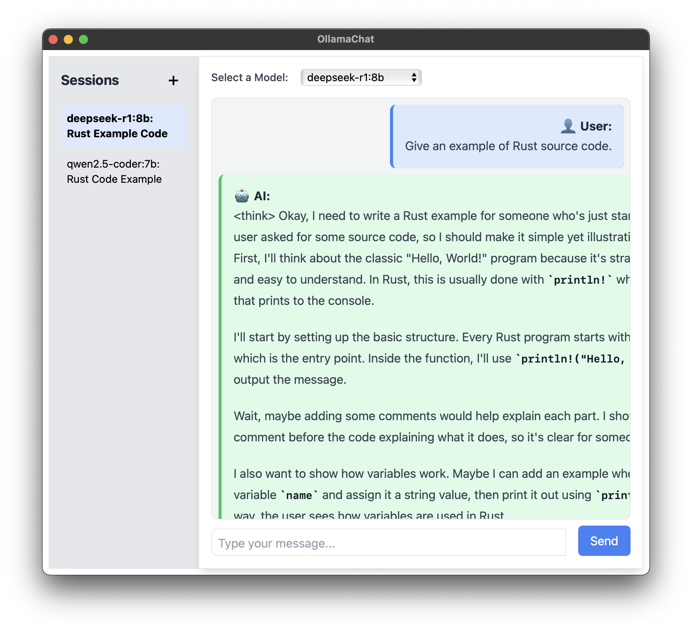
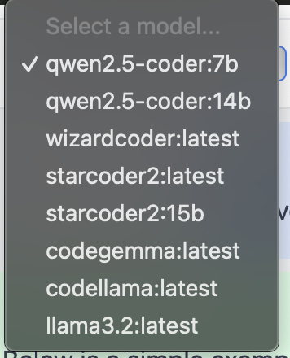
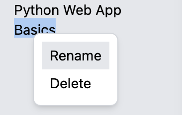

# OllamaChat

Simple prototype/proof-of-concept for a fully offline, cross-platform AI chat application using **React.js**, **Tauri**, **Rust**, and **SQLite** for the desktop app.  
The app integrates with a locally running Ollama API to retrieve models and generate responses.

Caveat:

The current feature set is rudimentary and only lightly tested.  Expect missing features and some defects.

## Ollama

Download Ollama here: https://ollama.com/

Load an Ollama model like this:

```bash
ollama run llama3.2:1b
```

Make sure Ollama API is running

```bash
ollama serve
```

The rust code is currently hard-coded for port 11434.

## Installation

```bash
git clone https://github.com/Tim-Butterfield/ollama-chat-tauri.git
cd ollama-chat-tauri
cd src/apps/desktop
npm install
npm run tauri
```

## Screenshots



The use of the ReactMarkdown component along with the Tailwind CSS typography prose style prettifies the output.



The model selection drop-down allows choosing from the currently loaded models.


Click the "+" button to start a new chat session.



The context menu allows for editing a session title or deleting a chat session you no longer need.
